# Link System Enhancement Proposals

**Project:** mloda
**Branch:** refactor/links
**Created:** October 22, 2025
**Priority System:** 🔴 Critical | 🟡 Important | 🟢 Nice-to-Have

---

## Quick Reference

| ID | Task | Priority | Effort | Impact | Status |
|----|------|----------|--------|--------|--------|
| T1 | Multi-Index Support | 🔴 | High | High | 📋 Proposed |
| T2 | Pointer Field Documentation | 🔴 | Low | Medium | 📋 Proposed |
| T3 | README Link Section | 🔴 | Low | High | 📋 Proposed |
| T4 | Link Builder API | 🟡 | Medium | High | 📋 Proposed |
| T5 | Visual Documentation | 🟡 | Medium | Medium | 📋 Proposed |
| T6 | Error Message Examples | 🟡 | Low | Medium | 📋 Proposed |
| T7 | Performance Profiling | 🟡 | Medium | Medium | 📋 Proposed |
| T8 | Link Inference Helper | 🟢 | High | Low | 📋 Proposed |
| T9 | Link Registry System | 🟢 | High | Low | 📋 Proposed |
| T10 | Advanced Join Types | 🟢 | High | Low | 📋 Proposed |

---

## 🔴 Critical Priority Tasks

These tasks address fundamental gaps or high-impact user experience issues.

---

### T1: Multi-Index Support Implementation

**Status:** 📋 Proposed
**Priority:** 🔴 Critical
**Effort:** 🔨🔨🔨 High (3-5 days)
**Impact:** 🎯🎯🎯 High

#### Problem Statement

All 6 compute frameworks currently reject multi-index joins with a `ValueError`. This limits users to single-column joins, blocking complex scenarios like time-series with composite keys.

#### Current Behavior

```python
# This fails in ALL frameworks:
Link.inner(
    left=(UserEvents, Index(('user_id', 'timestamp'))),
    right=(UserProfiles, Index(('id', 'created_at')))
)
# ValueError: MultiIndex is not yet implemented in {FrameworkName}
```

#### Desired Behavior

```python
# Should work:
Link.inner(
    left=(UserEvents, Index(('user_id', 'timestamp'))),
    right=(UserProfiles, Index(('id', 'created_at')))
)
```

#### Affected Files

```
mloda_plugins/compute_framework/base_implementations/
├── pandas/pandas_merge_engine.py (line: multi-index check)
├── polars/polars_merge_engine.py (line: multi-index check)
├── duckdb/duckdb_merge_engine.py (line: multi-index check)
├── spark/spark_merge_engine.py (line: multi-index check)
├── pyarrow/pyarrow_merge_engine.py (line: multi-index check)
└── python_dict/python_dict_merge_engine.py (line: multi-index check)
```

#### Implementation Steps

1. **Phase 1: Design (0.5 days)**
   - [ ] Review Index class multi-index handling
   - [ ] Design merge logic for composite keys
   - [ ] Document edge cases (different index lengths, null handling)

2. **Phase 2: Pandas Implementation (1 day)**
   - [ ] Implement multi-index merge in `pandas_merge_engine.py`
   - [ ] Add test cases to `tests/test_plugins/compute_framework/base_implementations/pandas/test_pandas_merge_engine.py`
   - [ ] Test all join types (INNER, LEFT, RIGHT, OUTER)
   - [ ] Validate index alignment and null handling

3. **Phase 3: Remaining Frameworks (2 days)**
   - [ ] Polars: Update `polars_merge_engine.py`
   - [ ] DuckDB: Update `duckdb_merge_engine.py`
   - [ ] Spark: Update `spark_merge_engine.py`
   - [ ] PyArrow: Update `pyarrow_merge_engine.py`
   - [ ] PythonDict: Update `python_dict_merge_engine.py`
   - [ ] Add test coverage for each framework

4. **Phase 4: Integration & Documentation (1 day)**
   - [ ] Update `docs/in_depth/join_data.md` with multi-index examples
   - [ ] Add end-to-end integration tests
   - [ ] Update FAQ if needed
   - [ ] Run full test suite (tox)

#### Test Cases Required

```python
# Test Case 1: Basic multi-index join
def test_multi_index_inner_join():
    link = Link.inner(
        left=(FeatureA, Index(('user_id', 'date'))),
        right=(FeatureB, Index(('id', 'timestamp')))
    )
    # Assert correct merge behavior

# Test Case 2: Different index lengths
def test_multi_index_different_lengths():
    # Should handle or error gracefully
    pass

# Test Case 3: Null values in index columns
def test_multi_index_with_nulls():
    # Define null handling behavior
    pass

# Test Case 4: Performance with large datasets
def test_multi_index_performance():
    # Benchmark vs single-index
    pass
```

#### Success Criteria

- [ ] All 6 frameworks support multi-index joins
- [ ] Test coverage ≥ 90% for multi-index paths
- [ ] Documentation includes 3+ multi-index examples
- [ ] Performance within 20% of single-index joins
- [ ] No breaking changes to existing single-index behavior

#### Dependencies

- None (can start immediately)

#### Risks

- **Performance:** Multi-index joins may be slower
  - **Mitigation:** Profile and optimize, document performance characteristics
- **Complexity:** Different frameworks handle composite keys differently
  - **Mitigation:** Start with Pandas (most common), establish pattern

---

### T2: Pointer Field Documentation & Cleanup

**Status:** 📋 Proposed
**Priority:** 🔴 Critical (UX confusion)
**Effort:** 🔨 Low (0.5 days)
**Impact:** 🎯🎯 Medium

#### Problem Statement

The `left_pointer` and `right_pointer` fields in the Link class are marked "Use only for special cases" with no further documentation. This creates confusion and potential misuse.

#### Current State

```python
# From link.py lines 38-40, 49-50:
left_pointer: Optional[Dict[str, Any]] = None,  # Use only for special cases
right_pointer: Optional[Dict[str, Any]] = None,  # Use only for special cases
```

#### Required Actions

1. **Investigation (0.25 days)**
   - [ ] Search codebase for actual usage of pointer fields
   - [ ] Grep for `left_pointer` and `right_pointer` references
   - [ ] Check git history for original purpose
   - [ ] Determine if still needed

2. **Decision & Implementation (0.25 days)**

   **Option A: Document Usage**
   ```python
   # If actively used:
   left_pointer: Optional[Dict[str, Any]] = None
   """
   Advanced: Override feature group resolution for self-joins.

   Use when the same feature group appears twice in a join:

   Example:
       link = Link.inner(
           left=(Events, Index(('user_id',))),
           right=(Events, Index(('parent_id',))),
           left_pointer={'alias': 'events_main'},
           right_pointer={'alias': 'events_parent'}
       )

   See: docs/advanced/self-joins.md for details.
   """
   ```

   **Option B: Deprecate**
   ```python
   # If not used:
   @deprecated("left_pointer is no longer needed. Use Index aliasing instead.")
   left_pointer: Optional[Dict[str, Any]] = None
   ```

   **Option C: Remove**
   ```python
   # If truly unused:
   # Remove fields entirely after deprecation period
   ```

3. **Documentation Updates**
   - [ ] Update `link.py` docstring
   - [ ] Add to FAQ if documented
   - [ ] Create advanced guide if complex usage
   - [ ] Update tests to reflect decision

#### Success Criteria

- [ ] Clear documentation or deprecation notice
- [ ] No confusion in user-facing API
- [ ] All references updated
- [ ] Tests validate expected behavior

---

### T3: README Links Section

**Status:** 📋 Proposed
**Priority:** 🔴 Critical (Discoverability)
**Effort:** 🔨 Low (0.5 days)
**Impact:** 🎯🎯🎯 High

#### Problem Statement

The main README.md (257 lines) does not mention Links at all. Users discovering mloda may not know when/why they need Links, leading to runtime errors.

#### Current README Structure

```markdown
README.md:
1. Introduction (cooking analogy)
2. Installation
3. Core API Call
4. Setting Up Data
5. Understanding Results
6. Features Parameter
7. Compute Frameworks
8. Data Access
9. Putting It All Together
10. Documentation Links
```

**Gap:** No section on when multiple data sources require Links.

#### Proposed Addition

**Location:** After "Section 7: Compute Frameworks", before "Section 8: Data Access"

```markdown
### 7.5 Joining Multiple Data Sources with Links

**When Do You Need Links?**

If your feature depends on multiple feature groups, you need to tell mloda how to join them:

```python
from mloda_core.abstract_plugins.components.link import Link
from mloda_core.abstract_plugins.components.index.index import Index

# Example: Combining user data with purchase history
links = {
    Link.inner(
        left=(UserProfiles, Index(('user_id',))),
        right=(Purchases, Index(('customer_id',)))
    )
}

result = mlodaAPI.run_all(
    features=["age", "total_purchases"],
    links=links,  # Tell mloda how to join the data
    compute_frameworks={PandasDataframe}
)
```

**Available Join Types:**
- `Link.inner()` - Only matching records from both sides
- `Link.left()` - All records from left, matches from right
- `Link.outer()` - All records from both sides
- `Link.append()` - Stack datasets vertically

📖 **Learn More:** [Complete Guide to Joining Data](https://mloda-ai.github.io/mloda/in_depth/join_data/)

> **Key Insight**: Think of Links like SQL JOIN statements - they define how mloda combines data from different sources.
```

#### Implementation Steps

1. **Draft Section (0.25 days)**
   - [ ] Write section with example
   - [ ] Ensure example is self-contained
   - [ ] Add visual indicator (emoji/icon)
   - [ ] Link to full documentation

2. **Integration (0.15 days)**
   - [ ] Insert after Compute Frameworks section
   - [ ] Update table of contents if present
   - [ ] Ensure markdown formatting
   - [ ] Check rendering on GitHub

3. **Review (0.1 days)**
   - [ ] Verify example code runs
   - [ ] Check links work
   - [ ] Review with team
   - [ ] Proofread

#### Success Criteria

- [ ] Links mentioned in README
- [ ] Clear "when to use" guidance
- [ ] Working code example
- [ ] Link to detailed docs
- [ ] Follows README style/tone

---

## 🟡 Important Priority Tasks

These tasks significantly improve developer experience and code quality.

---

### T4: Link Builder API

**Status:** 📋 Proposed
**Priority:** 🟡 Important
**Effort:** 🔨🔨 Medium (2 days)
**Impact:** 🎯🎯🎯 High

#### Problem Statement

Current Link API is verbose and repetitive:

```python
# Current: Too much boilerplate
link = Link.inner(
    left=(UserFeatureGroup, Index(('user_id',))),
    right=(PurchaseFeatureGroup, Index(('customer_id',)))
)
```

For projects with many links, this becomes cumbersome.

#### Proposed Solution: Fluent Builder API

```python
# Option 1: Fluent interface
link = (LinkBuilder()
    .between(UserFeatureGroup, PurchaseFeatureGroup)
    .on(left='user_id', right='customer_id')
    .inner()
    .build())

# Option 2: Contextual builder
with LinkBuilder() as lb:
    lb.inner(UserFeatureGroup, 'user_id') \
      .to(PurchaseFeatureGroup, 'customer_id')

    lb.left(PurchaseFeatureGroup, 'id') \
      .to(ProductFeatureGroup, 'purchase_id')

    links = lb.build()

# Option 3: Declarative (most concise)
links = LinkBuilder.create({
    UserFeatureGroup: {
        'user_id': (PurchaseFeatureGroup, 'customer_id', 'inner')
    },
    PurchaseFeatureGroup: {
        'id': (ProductFeatureGroup, 'purchase_id', 'left')
    }
})
```

#### Implementation

**New File:** `mloda_core/abstract_plugins/components/link_builder.py`

```python
from typing import Type, Dict, Set, Optional, Tuple
from mloda_core.abstract_plugins.abstract_feature_group import AbstractFeatureGroup
from mloda_core.abstract_plugins.components.link import Link, JoinType
from mloda_core.abstract_plugins.components.index.index import Index


class LinkBuilder:
    """
    Fluent API for building Links with less boilerplate.

    Examples:
        # Single link
        link = (LinkBuilder()
            .between(UserFeatureGroup, PurchaseFeatureGroup)
            .on(left='user_id', right='customer_id')
            .inner()
            .build())

        # Multiple links
        links = (LinkBuilder()
            .add_inner(UserFeatureGroup, 'user_id',
                       PurchaseFeatureGroup, 'customer_id')
            .add_left(PurchaseFeatureGroup, 'id',
                      ProductFeatureGroup, 'purchase_id')
            .build_set())
    """

    def __init__(self):
        self._links: Set[Link] = set()
        self._current_left: Optional[Type[AbstractFeatureGroup]] = None
        self._current_right: Optional[Type[AbstractFeatureGroup]] = None
        self._current_left_index: Optional[str] = None
        self._current_right_index: Optional[str] = None
        self._current_jointype: Optional[JoinType] = None

    def between(
        self,
        left: Type[AbstractFeatureGroup],
        right: Type[AbstractFeatureGroup]
    ) -> 'LinkBuilder':
        """Set the feature groups to link."""
        self._current_left = left
        self._current_right = right
        return self

    def on(
        self,
        left: str,
        right: str
    ) -> 'LinkBuilder':
        """Set the index columns to join on."""
        self._current_left_index = left
        self._current_right_index = right
        return self

    def inner(self) -> 'LinkBuilder':
        """Set join type to INNER."""
        self._current_jointype = JoinType.INNER
        return self

    def left(self) -> 'LinkBuilder':
        """Set join type to LEFT."""
        self._current_jointype = JoinType.LEFT
        return self

    def right(self) -> 'LinkBuilder':
        """Set join type to RIGHT."""
        self._current_jointype = JoinType.RIGHT
        return self

    def outer(self) -> 'LinkBuilder':
        """Set join type to OUTER."""
        self._current_jointype = JoinType.OUTER
        return self

    def build(self) -> Link:
        """Build a single Link from current state."""
        if not all([
            self._current_left,
            self._current_right,
            self._current_left_index,
            self._current_right_index,
            self._current_jointype
        ]):
            raise ValueError("Incomplete link specification")

        link = Link(
            jointype=self._current_jointype,
            left=(self._current_left, Index((self._current_left_index,))),
            right=(self._current_right, Index((self._current_right_index,)))
        )
        return link

    def add_inner(
        self,
        left_fg: Type[AbstractFeatureGroup],
        left_col: str,
        right_fg: Type[AbstractFeatureGroup],
        right_col: str
    ) -> 'LinkBuilder':
        """Add an INNER join link to the set."""
        link = Link.inner(
            left=(left_fg, Index((left_col,))),
            right=(right_fg, Index((right_col,)))
        )
        self._links.add(link)
        return self

    def build_set(self) -> Set[Link]:
        """Build a set of all accumulated links."""
        return self._links
```

#### Implementation Steps

1. **Core Builder (0.5 days)**
   - [ ] Create `link_builder.py`
   - [ ] Implement fluent interface
   - [ ] Add type hints
   - [ ] Write docstrings

2. **Testing (0.5 days)**
   - [ ] Unit tests for LinkBuilder
   - [ ] Test all join types
   - [ ] Test error cases
   - [ ] Integration tests with mlodaAPI

3. **Documentation (0.5 days)**
   - [ ] Add to `join_data.md`
   - [ ] Create examples
   - [ ] Update README
   - [ ] Add to API reference

4. **Migration Guide (0.5 days)**
   - [ ] Document old vs new syntax
   - [ ] Provide conversion examples
   - [ ] Note: old API still works (no breaking changes)

#### Success Criteria

- [ ] 50% reduction in link creation verbosity
- [ ] Backward compatible (old API still works)
- [ ] Test coverage ≥ 95%
- [ ] Documentation with 5+ examples
- [ ] Positive user feedback

---

### T5: Visual Documentation Enhancement

**Status:** 📋 Proposed
**Priority:** 🟡 Important
**Effort:** 🔨🔨 Medium (2 days)
**Impact:** 🎯🎯 Medium

#### Problem Statement

Current documentation is text-heavy. Visual learners struggle to understand:
- When Links are needed
- How data flows through joins
- Execution order

#### Proposed Additions

**1. Decision Tree: "Do I Need Links?"**

```mermaid
graph TD
    A[Creating a feature] --> B{Multiple input_features?}
    B -->|No| C[No Links needed]
    B -->|Yes| D{Same feature group?}
    D -->|Yes| E[No Links needed]
    D -->|No| F[✅ Links required!]

    F --> G[Define Link with join type]
    G --> H{How should data combine?}
    H -->|Match on key| I[Link.inner or Link.left]
    H -->|Stack vertically| J[Link.append]
    H -->|Combine all| K[Link.outer]

    style F fill:#f96,stroke:#333,stroke-width:2px
    style G fill:#9f9,stroke:#333,stroke-width:2px
```



**2. Execution Flow Diagram**


**3. Before/After Join Example**

```markdown
### Example: Inner Join

**Before Join:**

```python
# UserFeatureGroup
user_id | age | city
--------|-----|------
1       | 25  | NYC
2       | 30  | LA
3       | 35  | SF

# PurchaseFeatureGroup
customer_id | amount | date
------------|--------|-------
1           | 100    | 2025-01
2           | 200    | 2025-02
4           | 150    | 2025-03
```

**Link Definition:**

```python
Link.inner(
    left=(UserFeatureGroup, Index(('user_id',))),
    right=(PurchaseFeatureGroup, Index(('customer_id',)))
)
```

**After Join:**

```python
user_id | age | city | amount | date
--------|-----|------|--------|-------
1       | 25  | NYC  | 100    | 2025-01
2       | 30  | LA   | 200    | 2025-02
# Note: user_id=3 dropped (no matching purchase)
# Note: customer_id=4 dropped (no matching user)
```

#### File Updates

1. **`docs/in_depth/join_data.md`**
   - Add decision tree at top
   - Add execution flow diagram
   - Add before/after examples for all join types
   - Add FAQ section

2. **`docs/in_depth/link-examples.md`** (new file)
   - Complex join scenarios
   - Multi-step joins
   - Cross-framework joins
   - Performance tips

3. **`README.md`**
   - Add small decision tree graphic
   - Link to full documentation

#### Implementation Steps

1. **Diagram Creation (0.5 days)**
   - [ ] Create decision tree (Mermaid)
   - [ ] Create execution flow (Mermaid)
   - [ ] Create before/after tables

2. **Documentation Writing (1 day)**
   - [ ] Update `join_data.md`
   - [ ] Create `link-examples.md`
   - [ ] Write explanatory text
   - [ ] Add code examples

3. **Integration & Review (0.5 days)**
   - [ ] Test diagram rendering
   - [ ] Review with team
   - [ ] Gather feedback
   - [ ] Refine based on feedback

#### Success Criteria

- [ ] 3+ visual diagrams added
- [ ] 6+ before/after examples (one per join type)
- [ ] Diagrams render correctly in docs
- [ ] User feedback: "easier to understand"

---

### T6: Error Message Examples in Documentation

**Status:** 📋 Proposed
**Priority:** 🟡 Important
**Effort:** 🔨 Low (0.5 days)
**Impact:** 🎯🎯 Medium

#### Problem Statement

Users encounter link-related errors but documentation doesn't show what errors look like or how to fix them. The recent `test_missing_links_error.py` validates helpful errors, but users need to see examples.

#### Proposed Documentation Section

**New Section in `docs/in_depth/join_data.md`:**

```markdown
## Troubleshooting Link Errors

### Error 1: Missing Links

**You'll see this when:**
Your feature depends on multiple feature groups but you didn't provide links.

**Error Message:**
```
Exception: Feature 'MultiDependencyFeature' has multiple input features but no Links were provided.

When a feature depends on multiple feature groups, you must explicitly define how to join them using Links.

Example:
    links = {
        Link.inner(
            left=(FeatureGroupA, Index(('id',))),
            right=(FeatureGroupB, Index(('feature_a_id',)))
        )
    }

Available join types: inner, left, right, outer, append, union

See documentation: https://mloda-ai.github.io/mloda/in_depth/join_data/
```

**How to Fix:**
1. Identify which feature groups need to be joined
2. Determine the join keys (index columns)
3. Choose appropriate join type
4. Add Link to your `mlodaAPI.run_all()` call

**Example Fix:**
```python
# Before (error):
result = mlodaAPI.run_all(
    features=[Feature.int32_of("MultiDependencyFeature")],
    links=set(),  # ❌ Empty!
    compute_frameworks={PyarrowTable}
)

# After (fixed):
links = {
    Link.inner(
        left=(RootFeatureA, Index(('id',))),
        right=(RootFeatureB, Index(('id',)))
    )
}

result = mlodaAPI.run_all(
    features=[Feature.int32_of("MultiDependencyFeature")],
    links=links,  # ✅ Provided!
    compute_frameworks={PyarrowTable}
)
```

### Error 2: Conflicting Link Definitions

**You'll see this when:**
You've defined two different join types for the same feature group pair.

**Error Message:**
```
ValueError: Link <inner join A→B> and <left join A→B> have different join types for the same feature groups. Please remove one.
```

**How to Fix:**
Choose one join type per feature group pair.

### Error 3: Multi-Index Not Supported

**You'll see this when:**
You try to join on multiple columns (multi-index).

**Error Message:**
```
ValueError: MultiIndex is not yet implemented in PandasMergeEngine
```

**How to Fix:**
Currently, only single-column joins are supported.
- **Workaround:** Create a composite key column before joining
- **Future:** Multi-index support is planned (see issue #XXX)

### Error 4: Multiple Right Joins

**You'll see this when:**
You define multiple right joins involving the same feature group.

**Error Message:**
```
ValueError: Link <right join A→B> and <right join A→C> have multiple right joins for the same feature group on the left side. Please reconsider your join logic and if possible, use left joins instead of right joins.
```

**How to Fix:**
Convert right joins to left joins by swapping left/right feature groups:

```python
# Before (error):
Link.right(left=(A, Index(('id',))), right=(B, Index(('a_id',))))
Link.right(left=(A, Index(('id',))), right=(C, Index(('a_id',))))

# After (fixed):
Link.left(left=(B, Index(('a_id',))), right=(A, Index(('id',))))
Link.left(left=(C, Index(('a_id',))), right=(A, Index(('id',))))
```
```

#### Implementation Steps

1. **Collect Error Messages (0.1 days)**
   - [ ] Run code to generate each error
   - [ ] Copy exact error text
   - [ ] Screenshot if helpful

2. **Write Documentation (0.3 days)**
   - [ ] Add "Troubleshooting" section
   - [ ] Write 4-6 error scenarios
   - [ ] Include before/after code
   - [ ] Add "How to Fix" guidance

3. **Review & Publish (0.1 days)**
   - [ ] Verify examples are accurate
   - [ ] Test code snippets
   - [ ] Add to navigation
   - [ ] Deploy docs

#### Success Criteria

- [ ] 4+ common errors documented
- [ ] Each error has example and fix
- [ ] Code snippets are copy-paste ready
- [ ] Linked from error messages (if possible)

---

### T7: Performance Profiling & Optimization

**Status:** 📋 Proposed
**Priority:** 🟡 Important
**Effort:** 🔨🔨 Medium (2 days)
**Impact:** 🎯🎯 Medium

#### Problem Statement

No performance benchmarks exist for link resolution or execution. Potential issues:
- O(n²) validation loops in `link.py` (lines 149-183)
- Complex ordering algorithms in `LinkTrekker`
- Nested loops in link matching (resolve_links.py)

#### Goals

1. Establish performance baselines
2. Identify bottlenecks
3. Optimize if necessary
4. Document performance characteristics

#### Profiling Scenarios

**Scenario 1: Many Links**
```python
# 10, 50, 100, 500 links
links = {
    Link.inner(...) for _ in range(N)
}
# Measure: Validation time, resolution time
```

**Scenario 2: Complex Graph**
```python
# Deep dependency graph (10+ levels)
# Wide graph (100+ feature groups)
# Measure: Graph traversal time, queue generation time
```

**Scenario 3: Cross-Framework Joins**
```python
# Multiple compute frameworks
# Measure: Data conversion overhead, merge time
```

#### Implementation Steps

1. **Benchmark Suite (0.5 days)**
   - [ ] Create `tests/benchmarks/test_link_performance.py`
   - [ ] Use pytest-benchmark
   - [ ] Define test scenarios
   - [ ] Set up CI integration

2. **Profiling (0.5 days)**
   - [ ] Run cProfile on link resolution
   - [ ] Identify hotspots
   - [ ] Analyze algorithmic complexity
   - [ ] Create flame graphs

3. **Optimization (0.5 days)**
   - [ ] Optimize identified bottlenecks
   - [ ] Consider caching strategies
   - [ ] Reduce nested loops if possible
   - [ ] Re-run benchmarks

4. **Documentation (0.5 days)**
   - [ ] Document performance characteristics
   - [ ] Add "Performance Tips" section
   - [ ] Note complexity: O(n) vs O(n²)
   - [ ] Recommend best practices

#### Potential Optimizations

```python
# Optimization 1: Cache link validation
class Link:
    _validation_cache: Dict[frozenset, bool] = {}

    @staticmethod
    def validate(links: Optional[Set[Link]] = None) -> None:
        if links is None:
            return

        cache_key = frozenset(links)
        if cache_key in Link._validation_cache:
            return  # Already validated

        # ... existing validation logic ...

        Link._validation_cache[cache_key] = True

# Optimization 2: Index link matching
class ResolveLinks:
    def __init__(self, graph: Graph, links: Optional[Set[Link]] = None):
        self.graph = graph
        self.links = links
        self.link_trekker = LinkTrekker()

        # Build index for O(1) lookup
        self._link_index: Dict[Tuple[str, str], List[Link]] = {}
        if links:
            for link in links:
                key = (
                    link.left_feature_group.get_class_name(),
                    link.right_feature_group.get_class_name()
                )
                self._link_index.setdefault(key, []).append(link)
```

#### Success Criteria

- [ ] Benchmark suite established
- [ ] Performance characteristics documented
- [ ] No regressions in existing tests
- [ ] <100ms resolution time for 100 links
- [ ] CI runs benchmarks on each PR

---

## 🟢 Nice-to-Have Tasks

These tasks add convenience features but aren't critical.

---

### T8: Link Inference Helper

**Status:** 📋 Proposed
**Priority:** 🟢 Nice-to-Have
**Effort:** 🔨🔨🔨 High (3 days)
**Impact:** 🎯 Low (convenience feature)

#### Problem Statement

Users must manually create Links even when join relationships are obvious from index names (e.g., `user_id` → `user_id`).

#### Proposed Feature

```python
from mloda_core.abstract_plugins.components.link_helper import LinkInferenceHelper

# Automatic link suggestion
helper = LinkInferenceHelper(feature_groups={UserFeatureGroup, PurchaseFeatureGroup})
suggested_links = helper.suggest_links()

# Output:
# [
#   SuggestedLink(
#       left=UserFeatureGroup,
#       right=PurchaseFeatureGroup,
#       left_col='user_id',
#       right_col='customer_id',  # Inferred from similarity
#       confidence=0.85,
#       reasoning="Column names similar (user_id ≈ customer_id)"
#   )
# ]

# User can accept or modify
links = {suggestion.to_link(join_type='inner') for suggestion in suggested_links}
```

#### Implementation

**New File:** `mloda_core/abstract_plugins/components/link_helper.py`

```python
from typing import Set, Type, List
from dataclasses import dataclass
from mloda_core.abstract_plugins.abstract_feature_group import AbstractFeatureGroup
from mloda_core.abstract_plugins.components.link import Link
from mloda_core.abstract_plugins.components.index.index import Index


@dataclass
class SuggestedLink:
    left: Type[AbstractFeatureGroup]
    right: Type[AbstractFeatureGroup]
    left_col: str
    right_col: str
    confidence: float
    reasoning: str

    def to_link(self, join_type: str = 'inner') -> Link:
        """Convert suggestion to actual Link."""
        return Link(
            jointype=join_type,
            left=(self.left, Index((self.left_col,))),
            right=(self.right, Index((self.right_col,)))
        )


class LinkInferenceHelper:
    """Suggests Links based on feature group schemas."""

    def __init__(self, feature_groups: Set[Type[AbstractFeatureGroup]]):
        self.feature_groups = feature_groups

    def suggest_links(self) -> List[SuggestedLink]:
        """
        Infer possible links by analyzing:
        1. Column name similarity
        2. Data type compatibility
        3. Common naming patterns (id, user_id, etc.)
        """
        suggestions = []

        for fg_a in self.feature_groups:
            for fg_b in self.feature_groups:
                if fg_a == fg_b:
                    continue

                # Get schemas (would need schema introspection)
                schema_a = self._get_schema(fg_a)
                schema_b = self._get_schema(fg_b)

                # Find matching columns
                matches = self._find_column_matches(schema_a, schema_b)

                for match in matches:
                    suggestions.append(SuggestedLink(
                        left=fg_a,
                        right=fg_b,
                        left_col=match['left_col'],
                        right_col=match['right_col'],
                        confidence=match['confidence'],
                        reasoning=match['reasoning']
                    ))

        return suggestions

    def _get_schema(self, fg: Type[AbstractFeatureGroup]) -> dict:
        """Extract schema from feature group (needs implementation)."""
        # Would introspect input_data() or calculate_feature()
        pass

    def _find_column_matches(self, schema_a: dict, schema_b: dict) -> List[dict]:
        """Find matching columns using heuristics."""
        matches = []

        for col_a in schema_a:
            for col_b in schema_b:
                similarity = self._column_similarity(col_a, col_b)
                if similarity > 0.7:
                    matches.append({
                        'left_col': col_a,
                        'right_col': col_b,
                        'confidence': similarity,
                        'reasoning': f"Column names similar ({col_a} ≈ {col_b})"
                    })

        return matches

    def _column_similarity(self, col_a: str, col_b: str) -> float:
        """Calculate similarity between column names."""
        # Simple heuristics:
        if col_a == col_b:
            return 1.0

        # Remove common suffixes
        for suffix in ['_id', '_key', '_fk']:
            col_a_clean = col_a.replace(suffix, '')
            col_b_clean = col_b.replace(suffix, '')
            if col_a_clean == col_b_clean:
                return 0.9

        # Levenshtein distance (would use library)
        # ...

        return 0.0
```

#### Use Case

```python
# Scenario: User has 10 feature groups, unsure which need links

from mloda_core.abstract_plugins.components.link_helper import LinkInferenceHelper

helper = LinkInferenceHelper(feature_groups=all_feature_groups)
suggestions = helper.suggest_links()

print("Suggested Links:")
for i, suggestion in enumerate(suggestions):
    print(f"{i+1}. {suggestion.left.__name__} → {suggestion.right.__name__}")
    print(f"   Join on: {suggestion.left_col} = {suggestion.right_col}")
    print(f"   Confidence: {suggestion.confidence:.0%}")
    print(f"   Reasoning: {suggestion.reasoning}\n")

# User reviews and accepts
accepted_indices = [0, 2, 5]  # User input
links = {suggestions[i].to_link('inner') for i in accepted_indices}

result = mlodaAPI.run_all(features=features, links=links)
```

#### Implementation Steps

1. **Schema Introspection (1 day)**
   - [ ] Design schema extraction API
   - [ ] Implement for DataCreator
   - [ ] Implement for file-based data
   - [ ] Handle edge cases

2. **Similarity Algorithms (1 day)**
   - [ ] Implement column name matching
   - [ ] Add Levenshtein distance
   - [ ] Add common pattern detection
   - [ ] Tune confidence thresholds

3. **Helper Implementation (0.5 days)**
   - [ ] Create LinkInferenceHelper class
   - [ ] Implement suggest_links()
   - [ ] Add filtering options
   - [ ] Write tests

4. **Integration & Documentation (0.5 days)**
   - [ ] Add to mlodaAPI workflow
   - [ ] Write documentation
   - [ ] Create tutorial
   - [ ] Add to CLI (optional)

#### Success Criteria

- [ ] Suggests correct links for 80%+ of test cases
- [ ] Low false positive rate (<10%)
- [ ] Clear confidence scores
- [ ] Easy to accept/reject suggestions

---

### T9: Link Registry System

**Status:** 📋 Proposed
**Priority:** 🟢 Nice-to-Have
**Effort:** 🔨🔨🔨 High (3 days)
**Impact:** 🎯 Low (organizational convenience)

#### Problem Statement

In large projects, Links are scattered across code. No central place to manage or discover existing Links.

#### Proposed Feature

```python
# Global link registry
from mloda_core.abstract_plugins.components.link_registry import LinkRegistry

# Register links (once, in project setup)
LinkRegistry.register(
    name="user_to_purchases",
    link=Link.inner(
        left=(UserFeatureGroup, Index(('user_id',))),
        right=(PurchaseFeatureGroup, Index(('customer_id',)))
    ),
    description="Joins users with their purchase history",
    tags=["user", "purchase", "transactional"]
)

# Later, use by name
links = LinkRegistry.get_by_tags(["user", "purchase"])

result = mlodaAPI.run_all(features=features, links=links)

# Or, auto-discover needed links
links = LinkRegistry.infer_for_features(features)
```

#### Implementation

**New File:** `mloda_core/abstract_plugins/components/link_registry.py`

```python
from typing import Dict, Set, List, Optional
from mloda_core.abstract_plugins.components.link import Link


class LinkRegistry:
    """
    Central registry for managing and discovering Links.

    Usage:
        # Register
        LinkRegistry.register("user_purchases", link, description="...")

        # Retrieve
        link = LinkRegistry.get("user_purchases")
        links = LinkRegistry.get_all()
        links = LinkRegistry.get_by_tags(["user"])

        # Auto-discover
        links = LinkRegistry.infer_for_features(features)
    """

    _registry: Dict[str, 'RegisteredLink'] = {}

    @classmethod
    def register(
        cls,
        name: str,
        link: Link,
        description: str = "",
        tags: Optional[List[str]] = None
    ) -> None:
        """Register a link with metadata."""
        cls._registry[name] = RegisteredLink(
            name=name,
            link=link,
            description=description,
            tags=tags or []
        )

    @classmethod
    def get(cls, name: str) -> Link:
        """Get a link by name."""
        if name not in cls._registry:
            raise KeyError(f"Link '{name}' not found in registry")
        return cls._registry[name].link

    @classmethod
    def get_all(cls) -> Set[Link]:
        """Get all registered links."""
        return {entry.link for entry in cls._registry.values()}

    @classmethod
    def get_by_tags(cls, tags: List[str]) -> Set[Link]:
        """Get links matching any of the provided tags."""
        matching = set()
        for entry in cls._registry.values():
            if any(tag in entry.tags for tag in tags):
                matching.add(entry.link)
        return matching

    @classmethod
    def infer_for_features(cls, features: List) -> Set[Link]:
        """
        Infer which registered links are needed for the given features.
        Analyzes feature dependencies and returns relevant links.
        """
        # Would analyze feature group dependencies
        # Return links connecting those feature groups
        pass

    @classmethod
    def list_registered(cls) -> List[str]:
        """List all registered link names."""
        return list(cls._registry.keys())

    @classmethod
    def clear(cls) -> None:
        """Clear registry (useful for testing)."""
        cls._registry.clear()


@dataclass
class RegisteredLink:
    """Metadata wrapper for a registered Link."""
    name: str
    link: Link
    description: str
    tags: List[str]
```

**Project Setup File:** `project_links.py`

```python
# Central place to define all project links

from mloda_core.abstract_plugins.components.link_registry import LinkRegistry
from my_project.feature_groups import *

# User-related links
LinkRegistry.register(
    name="user_to_purchases",
    link=Link.inner(
        left=(UserFeatureGroup, Index(('user_id',))),
        right=(PurchaseFeatureGroup, Index(('customer_id',)))
    ),
    description="Joins users with their purchase history",
    tags=["user", "purchase", "core"]
)

LinkRegistry.register(
    name="user_to_preferences",
    link=Link.left(
        left=(UserFeatureGroup, Index(('user_id',))),
        right=(PreferenceFeatureGroup, Index(('user_id',)))
    ),
    description="Joins users with preferences (left join to handle missing preferences)",
    tags=["user", "preference"]
)

# Product-related links
LinkRegistry.register(
    name="purchase_to_product",
    link=Link.inner(
        left=(PurchaseFeatureGroup, Index(('product_id',))),
        right=(ProductFeatureGroup, Index(('id',)))
    ),
    description="Enriches purchases with product details",
    tags=["purchase", "product"]
)

# ... more links ...
```

**Usage:**

```python
# In main application code
import project_links  # Auto-registers all links

# Option 1: Use specific links
links = {LinkRegistry.get("user_to_purchases")}

# Option 2: Use by tags
links = LinkRegistry.get_by_tags(["user", "purchase"])

# Option 3: Auto-infer (smart!)
features = ["age", "total_purchases", "product_category"]
links = LinkRegistry.infer_for_features(features)

result = mlodaAPI.run_all(features=features, links=links)
```

#### Benefits

1. **Centralization:** All links in one place
2. **Discoverability:** Easy to find existing links
3. **Reusability:** Define once, use everywhere
4. **Documentation:** Built-in descriptions and tags
5. **Auto-discovery:** Automatically select needed links

#### Implementation Steps

1. **Core Registry (1 day)**
   - [ ] Implement LinkRegistry class
   - [ ] Add registration methods
   - [ ] Add retrieval methods
   - [ ] Write unit tests

2. **Inference Logic (1 day)**
   - [ ] Analyze feature dependencies
   - [ ] Match links to feature groups
   - [ ] Handle complex scenarios
   - [ ] Test inference accuracy

3. **Integration (0.5 days)**
   - [ ] Add to mlodaAPI workflow
   - [ ] Support optional auto-discovery
   - [ ] Backward compatibility check

4. **Documentation (0.5 days)**
   - [ ] Write usage guide
   - [ ] Create example project structure
   - [ ] Add to best practices
   - [ ] Document trade-offs

#### Success Criteria

- [ ] Registry stores and retrieves links
- [ ] Tag-based filtering works
- [ ] Auto-inference ≥70% accurate
- [ ] Documentation with complete example
- [ ] No performance impact

---

### T10: Advanced Join Types

**Status:** 📋 Proposed
**Priority:** 🟢 Nice-to-Have
**Effort:** 🔨🔨🔨 High (4 days)
**Impact:** 🎯 Low (niche use cases)

#### Problem Statement

mloda currently supports standard join types (INNER, LEFT, RIGHT, OUTER, APPEND, UNION). Advanced use cases may need:
- **ASOF joins** (time-series "as-of" matching)
- **SEMI joins** (exists check)
- **ANTI joins** (not exists check)
- **CROSS joins** (cartesian product)

#### Proposed Additions

**1. ASOF Join (Time-Series)**

```python
from mloda_core.abstract_plugins.components.link import Link, JoinType

# New join type
class JoinType(Enum):
    INNER = "inner"
    LEFT = "left"
    RIGHT = "right"
    OUTER = "outer"
    APPEND = "append"
    UNION = "union"
    ASOF = "asof"  # NEW
    SEMI = "semi"  # NEW
    ANTI = "anti"  # NEW
    CROSS = "cross"  # NEW

# Usage: Match nearest time
link = Link.asof(
    left=(StockPrices, Index(('timestamp',))),
    right=(TradingVolume, Index(('timestamp',))),
    tolerance='5min'  # Match within 5 minutes
)
```

**Use Case:**
```python
# Stock prices (every minute)
timestamp | symbol | price
----------|--------|------
10:00:00  | AAPL   | 150.00
10:01:00  | AAPL   | 150.50
10:02:00  | AAPL   | 151.00

# Trading volume (every 5 minutes)
timestamp | symbol | volume
----------|--------|-------
10:00:00  | AAPL   | 1000
10:05:00  | AAPL   | 1500

# ASOF join: Each price gets nearest prior volume
timestamp | symbol | price  | volume
----------|--------|--------|-------
10:00:00  | AAPL   | 150.00 | 1000
10:01:00  | AAPL   | 150.50 | 1000  # Uses 10:00:00 volume
10:02:00  | AAPL   | 151.00 | 1000  # Uses 10:00:00 volume
```

**2. SEMI Join (Exists Check)**

```python
# Only keep left rows that have a match in right
link = Link.semi(
    left=(Users, Index(('user_id',))),
    right=(PurchasesLast30Days, Index(('customer_id',)))
)
# Result: Only users who made purchases in last 30 days
```

**3. ANTI Join (Not Exists Check)**

```python
# Only keep left rows that DON'T have a match in right
link = Link.anti(
    left=(Users, Index(('user_id',))),
    right=(PurchasesLast30Days, Index(('customer_id',)))
)
# Result: Only users who DIDN'T make purchases in last 30 days
```

**4. CROSS Join (Cartesian Product)**

```python
# Every combination (use with caution!)
link = Link.cross(
    left=(Products, Index(())),  # Empty index for cross join
    right=(Stores, Index(()))
)
# Result: Every product × every store
```

#### Implementation

**Phase 1: Update Link Class**
```python
# mloda_core/abstract_plugins/components/link.py

class JoinType(Enum):
    # ... existing ...
    ASOF = "asof"
    SEMI = "semi"
    ANTI = "anti"
    CROSS = "cross"

class Link:
    def __init__(
        self,
        jointype: Union[JoinType, str],
        left: Tuple[Type[Any], Index],
        right: Tuple[Type[Any], Index],
        # New optional parameters
        tolerance: Optional[str] = None,  # For ASOF joins
        direction: str = "backward",  # For ASOF: "backward", "forward", "nearest"
    ) -> None:
        # ... existing ...
        self.tolerance = tolerance
        self.direction = direction

    @classmethod
    def asof(
        cls,
        left: Tuple[Type[Any], Index],
        right: Tuple[Type[Any], Index],
        tolerance: Optional[str] = None,
        direction: str = "backward"
    ) -> Link:
        return cls(JoinType.ASOF, left, right, tolerance=tolerance, direction=direction)

    @classmethod
    def semi(cls, left: Tuple[Type[Any], Index], right: Tuple[Type[Any], Index]) -> Link:
        return cls(JoinType.SEMI, left, right)

    @classmethod
    def anti(cls, left: Tuple[Type[Any], Index], right: Tuple[Type[Any], Index]) -> Link:
        return cls(JoinType.ANTI, left, right)

    @classmethod
    def cross(cls, left: Tuple[Type[Any], Index], right: Tuple[Type[Any], Index]) -> Link:
        return cls(JoinType.CROSS, left, right)
```

**Phase 2: Update BaseMergeEngine**
```python
# mloda_core/abstract_plugins/components/merge/base_merge_engine.py

class BaseMergeEngine:
    @final
    def merge(self, left_data: Any, right_data: Any, jointype: JoinType, left_index: Index, right_index: Index, **kwargs: Any) -> Any:
        if jointype == JoinType.INNER:
            return self.merge_inner(left_data, right_data, left_index, right_index)
        # ... existing ...
        if jointype == JoinType.ASOF:
            return self.merge_asof(left_data, right_data, left_index, right_index, **kwargs)
        if jointype == JoinType.SEMI:
            return self.merge_semi(left_data, right_data, left_index, right_index)
        if jointype == JoinType.ANTI:
            return self.merge_anti(left_data, right_data, left_index, right_index)
        if jointype == JoinType.CROSS:
            return self.merge_cross(left_data, right_data)

    def merge_asof(self, left_data: Any, right_data: Any, left_index: Index, right_index: Index, **kwargs: Any) -> Any:
        raise NotImplementedError("ASOF join not implemented")

    def merge_semi(self, left_data: Any, right_data: Any, left_index: Index, right_index: Index) -> Any:
        raise NotImplementedError("SEMI join not implemented")

    def merge_anti(self, left_data: Any, right_data: Any, left_index: Index, right_index: Index) -> Any:
        raise NotImplementedError("ANTI join not implemented")

    def merge_cross(self, left_data: Any, right_data: Any) -> Any:
        raise NotImplementedError("CROSS join not implemented")
```

**Phase 3: Implement for Each Framework**

Each of the 6 frameworks needs implementations:

```python
# Example: Pandas
class PandasMergeEngine(BaseMergeEngine):
    def merge_asof(self, left_data: Any, right_data: Any, left_index: Index, right_index: Index, **kwargs: Any) -> Any:
        tolerance = kwargs.get('tolerance')
        direction = kwargs.get('direction', 'backward')

        return pd.merge_asof(
            left_data,
            right_data,
            left_on=left_index.index[0],
            right_on=right_index.index[0],
            tolerance=pd.Timedelta(tolerance) if tolerance else None,
            direction=direction
        )

    def merge_semi(self, left_data: Any, right_data: Any, left_index: Index, right_index: Index) -> Any:
        # Keep rows in left that have a match in right
        merged = pd.merge(
            left_data,
            right_data[[right_index.index[0]]],
            left_on=left_index.index[0],
            right_on=right_index.index[0],
            how='inner'
        )
        # Drop right columns, keep only left
        return merged[left_data.columns]

    def merge_anti(self, left_data: Any, right_data: Any, left_index: Index, right_index: Index) -> Any:
        # Keep rows in left that DON'T have a match in right
        merged = pd.merge(
            left_data,
            right_data[[right_index.index[0]]],
            left_on=left_index.index[0],
            right_on=right_index.index[0],
            how='left',
            indicator=True
        )
        anti_joined = merged[merged['_merge'] == 'left_only']
        return anti_joined.drop(columns=['_merge', right_index.index[0]])

    def merge_cross(self, left_data: Any, right_data: Any) -> Any:
        left_data['_cross_key'] = 1
        right_data['_cross_key'] = 1
        result = pd.merge(left_data, right_data, on='_cross_key')
        return result.drop(columns=['_cross_key'])
```

#### Implementation Steps

1. **Design & Specification (0.5 days)**
   - [ ] Finalize API design
   - [ ] Document semantics for each join type
   - [ ] Define edge cases
   - [ ] Review with team

2. **Core Implementation (1 day)**
   - [ ] Update JoinType enum
   - [ ] Update Link class with new methods
   - [ ] Update BaseMergeEngine interface
   - [ ] Update validation logic

3. **Framework Implementations (2 days)**
   - [ ] Pandas: Implement all 4 join types
   - [ ] Polars: Implement all 4 join types
   - [ ] DuckDB: Implement all 4 join types
   - [ ] Spark: Implement all 4 join types
   - [ ] PyArrow: Implement all 4 join types (may be limited)
   - [ ] PythonDict: Implement all 4 join types

4. **Testing & Documentation (0.5 days)**
   - [ ] Unit tests for each join type
   - [ ] Integration tests
   - [ ] Update documentation
   - [ ] Add examples for each join type

#### Success Criteria

- [ ] All 4 new join types work in all frameworks
- [ ] Test coverage ≥ 85%
- [ ] Documentation with use case examples
- [ ] No breaking changes
- [ ] Performance acceptable

---

## Implementation Priority Matrix

```
          High Impact
               ↑
    T3 README  │  T1 Multi-Index
               │
               │  T4 Link Builder
               │
    ───────────┼──────────────→ High Effort
               │
    T6 Errors  │  T7 Performance
    T2 Pointers│
               │  T8 Inference
               │  T9 Registry
               │  T10 Advanced Joins
          Low Impact
```

## Recommended Implementation Order

### Sprint 1 (Week 1)
1. **T3: README Links Section** (0.5 days) - Quick win
2. **T2: Pointer Documentation** (0.5 days) - Clear confusion
3. **T6: Error Examples** (0.5 days) - Improve UX
4. **T1: Multi-Index (Start)** (2 days) - Begin critical feature

### Sprint 2 (Week 2)
5. **T1: Multi-Index (Complete)** (1 day) - Finish critical feature
6. **T4: Link Builder API** (2 days) - Major UX improvement
7. **T5: Visual Documentation** (2 days) - Enhance learning

### Sprint 3 (Week 3)
8. **T7: Performance Profiling** (2 days) - Optimization
9. **Optional: T8-T10** - If time and user demand exists

---

## Acceptance Criteria Template

For each task, ensure:
- [ ] **Functionality:** Feature works as specified
- [ ] **Tests:** ≥85% coverage for new code
- [ ] **Documentation:** User-facing docs updated
- [ ] **Backward Compatibility:** No breaking changes
- [ ] **Performance:** No regressions
- [ ] **Code Review:** Approved by team
- [ ] **CI/CD:** All checks pass

---

## Risk Assessment

| Risk | Probability | Impact | Mitigation |
|------|------------|--------|------------|
| Multi-index breaks existing code | Low | High | Extensive testing, gradual rollout |
| Link Builder confusion | Medium | Low | Clear documentation, examples |
| Performance regression | Medium | Medium | Benchmark suite, profiling |
| Scope creep (T8-T10) | High | Low | Prioritize T1-T7, defer nice-to-haves |

---

## Success Metrics

After implementing critical tasks (T1-T3):
- [ ] ≥50% reduction in link-related support questions
- [ ] ≥30% increase in link usage (telemetry)
- [ ] ≥90% user satisfaction in surveys
- [ ] Zero P1 bugs introduced

---

## Version History

| Version | Date | Changes | Author |
|---------|------|---------|--------|
| 1.0 | 2025-10-22 | Initial proposal | Claude Code Analysis |

---

**Next Steps:**
1. Review this proposal with team
2. Prioritize tasks based on team capacity
3. Create GitHub issues for approved tasks
4. Assign tasks to sprint
5. Begin implementation!
