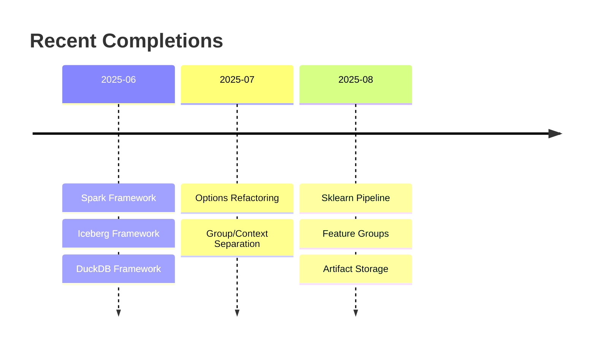

# Active Context

## Current Status



## Current Work Focus

✅ **Phase 1 Completed: Options Object Refactoring**
- Implemented group/context parameter separation
- Feature Groups now correctly split only on isolation-requiring parameters
- Full backward compatibility maintained

✅ **Sklearn Pipeline Feature Group**
- File-based artifact storage with joblib
- Comprehensive pipeline management
- 43 test cases, all passing

## Next Steps

- Add integration tests for filtering with compute frameworks
- Phase 2: Individual sklearn transformation feature groups
- Continue feature group parameter migration

## Active Architecture

```mermaid
flowchart TD
    Options --> |group| Isolation[Feature Group Splitting]
    Options --> |context| Metadata[Algorithm Parameters]
    
    Isolation --> |Different Sources| Split[Separate Resolution]
    Metadata --> |Same Group| Together[Resolve Together]
    
    style Options fill:#bbf,stroke:#333,stroke-width:2px
