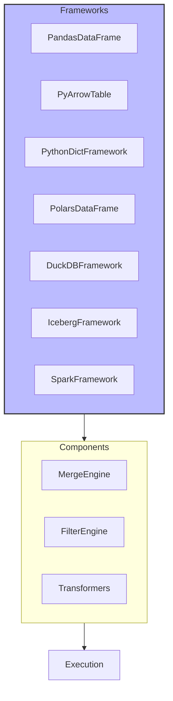
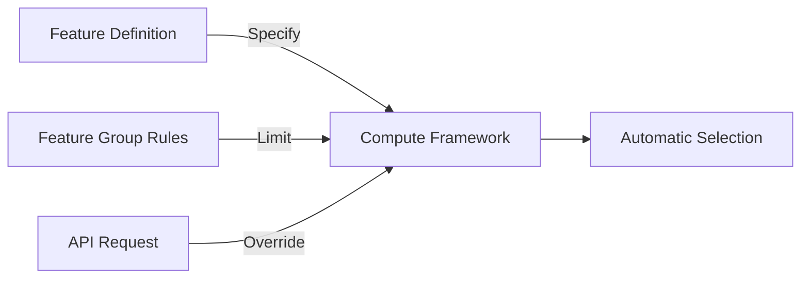

# Compute Frameworks

## Overview

Compute Frameworks define the technology stack for executing feature transformations, decoupling feature definitions from specific computation technologies.



## Available Frameworks

### Core Frameworks
- **PandasDataFrame**: Rich data manipulation, good for development
- **PyArrowTable**: Memory-efficient columnar format, production-ready
- **PythonDictFramework**: Dependency-free, List[Dict] structure

### Advanced Frameworks
- **PolarsDataFrame**: High-performance Rust-based, lazy evaluation
- **DuckDBFramework**: SQL interface, OLAP workloads
- **IcebergFramework**: Data lake management, schema evolution
- **SparkFramework**: Distributed processing, big data

## Framework Selection



## Framework Transformers

Enable seamless conversion between data representations:

```python
# Automatic transformation when needed
PandasDataFrame <--> PyArrowTable
PyArrowTable <--> PolarsDataFrame
PyArrowTable <--> SparkDataframe
```

## Integration Pattern

```python
@classmethod
def compute_framework_rule(cls):
    return {PandasDataFrame}  # Specific framework
    # Or return True for all frameworks
