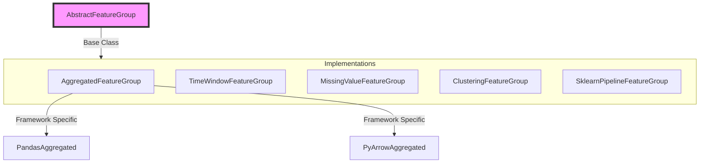
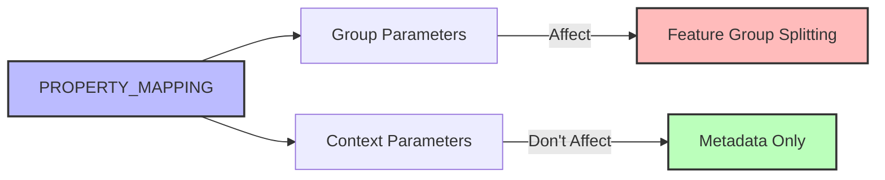
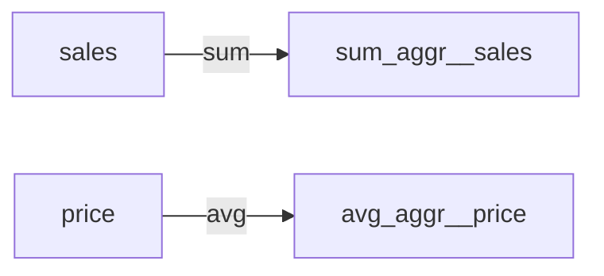
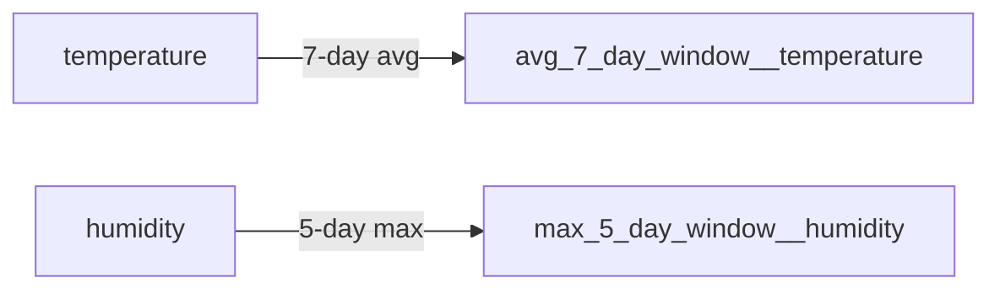
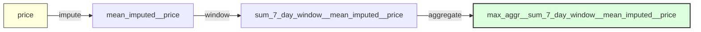

# Feature Groups

## Overview

Feature Groups are core components that define feature dependencies and calculations using a modern configuration-based architecture.



## Implemented Feature Groups

### Core Feature Groups
- **AggregatedFeatureGroup**: Sum, avg, min, max aggregations
- **TimeWindowFeatureGroup**: Time-based window operations (e.g., 7-day averages)
- **MissingValueFeatureGroup**: Mean, median, mode, constant, ffill, bfill imputation

### Analytics Feature Groups
- **ClusteringFeatureGroup**: K-means, DBSCAN, hierarchical clustering
- **DimensionalityReductionFeatureGroup**: PCA, t-SNE, ICA, LDA, Isomap
- **ForecastingFeatureGroup**: Linear, random forest, SVR time series forecasting
- **NodeCentralityFeatureGroup**: Degree, betweenness, closeness, pagerank centrality

### Processing Feature Groups
- **TextCleaningFeatureGroup**: Text normalization, stopword removal, punctuation cleaning
- **GeoDistanceFeatureGroup**: Haversine, euclidean, manhattan distance calculations
- **SklearnPipelineFeatureGroup**: Sklearn transformers and pipelines

## Key Architecture

### PROPERTY_MAPPING Configuration



**Context Parameters** (Don't affect resolution):
- Algorithm parameters (aggregation_type, window_function)
- Source features (mloda_source_features)
- Configuration settings

**Group Parameters** (Affect resolution):
- Data source isolation
- Environment parameters
- Version boundaries

### Core Methods

```python
class AbstractFeatureGroup:
    # Required Implementation
    def calculate_feature(features: FeatureCollection) -> DataCreator

    # Meta Methods
    def description() -> str
    def version() -> str
    def match_feature_group_criteria(feature_name, options) -> bool

    # Configuration
    def input_features(options, feature_name) -> Set[Feature]
    def compute_framework_rule() -> Set[ComputeFramework]
```

### Multi-Column Utilities

AbstractFeatureGroup provides utilities for working with multi-column features (pattern: `feature~0`, `~1`, `~2`):

```python
class AbstractFeatureGroup:
    # Producer utilities - creating multi-column outputs
    @staticmethod
    def apply_naming_convention(result, feature_name, suffix_generator=None) -> Dict[str, Any]
    @staticmethod
    def expand_feature_columns(feature_name, num_columns) -> List[str]

    # Consumer utilities - discovering multi-column inputs
    @staticmethod
    def resolve_multi_column_feature(feature_name, available_columns) -> List[str]

    # Parsing utilities
    @staticmethod
    def get_column_base_feature(column_name) -> str
```

**Usage Pattern**:
- **Producer**: Use `apply_naming_convention()` to create `~N` suffixed columns from numpy arrays
- **Consumer**: Use `resolve_multi_column_feature()` to auto-discover all matching columns
- **Both**: Use `get_column_base_feature()` to strip suffixes when needed

**Example Flow**:
```python
# Producer creates multi-column output
result = encoder.transform(data)  # 2D array
named_cols = cls.apply_naming_convention(result, "onehot_encoded__state")
# Returns: {"onehot_encoded__state~0": [data], "~1": [data], "~2": [data]}

# Consumer discovers columns automatically
cols = cls.resolve_multi_column_feature("onehot_encoded__state", data.columns)
# Returns: ["onehot_encoded__state~0", "~1", "~2"]

# Process all discovered columns
for col in cols:
    process(data[col])
```

## Feature Patterns

### 1. Aggregated Pattern

**Convention**: `{aggregation_type}_aggr__{source_feature}`



```python
PROPERTY_MAPPING = {
    AGGREGATION_TYPE: {
        **AGGREGATION_TYPES_DICT,
        DefaultOptionKeys.mloda_context: True,  # Context parameter
    },
    DefaultOptionKeys.mloda_source_features: {
        DefaultOptionKeys.mloda_context: True,
    },
}
```

### 2. Time Window Pattern

**Convention**: `{function}_{size}_{unit}_window__{source_feature}`



### 3. Feature Chaining

Complex features through composition:



## Implementation Guide

### Dual Approach Support

```python
# String-based (Legacy)
feature = Feature("sum_aggr__sales")

# Configuration-based (Modern)
feature = Feature(
    "placeholder",
    Options(context={
        "aggregation_type": "sum",
        DefaultOptionKeys.mloda_source_features: "sales"
    })
)
```

### Feature Group Authority

Each Feature Group defines its own parameter categorization:
