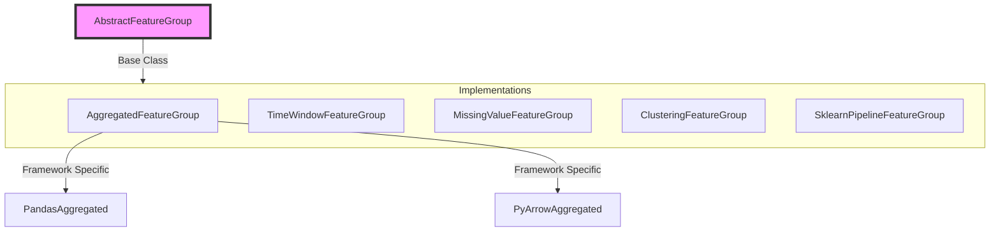
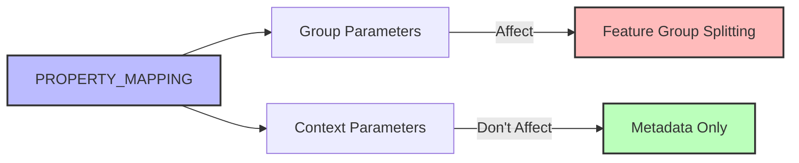
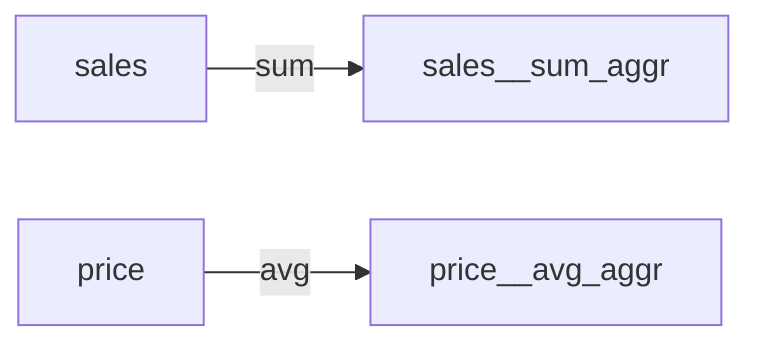
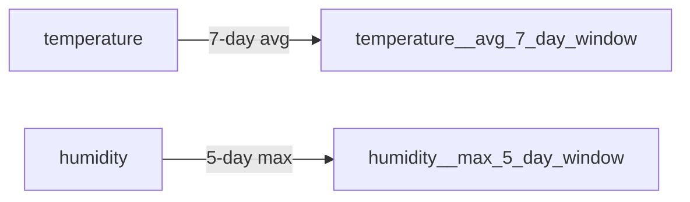
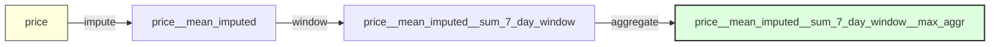

# Feature Groups

## Overview

Feature Groups are core components that define feature dependencies and calculations using a modern configuration-based architecture.



## Implemented Feature Groups

### Core Feature Groups
- **AggregatedFeatureGroup**: Sum, avg, min, max aggregations
- **TimeWindowFeatureGroup**: Time-based window operations (e.g., 7-day averages)
- **MissingValueFeatureGroup**: Mean, median, mode, constant, ffill, bfill imputation

### Analytics Feature Groups
- **ClusteringFeatureGroup**: K-means, DBSCAN, hierarchical clustering
- **DimensionalityReductionFeatureGroup**: PCA, t-SNE, ICA, LDA, Isomap
- **ForecastingFeatureGroup**: Linear, random forest, SVR time series forecasting
- **NodeCentralityFeatureGroup**: Degree, betweenness, closeness, pagerank centrality

### Processing Feature Groups
- **TextCleaningFeatureGroup**: Text normalization, stopword removal, punctuation cleaning
- **GeoDistanceFeatureGroup**: Haversine, euclidean, manhattan distance calculations
- **SklearnPipelineFeatureGroup**: Sklearn transformers and pipelines

## Key Architecture

### FeatureChainParserMixin

All feature groups that use feature chain parsing inherit from `FeatureChainParserMixin`, which provides default implementations for `input_features()` and `match_feature_group_criteria()`.

```python
from mloda_core.abstract_plugins.components.feature_chainer.feature_chain_parser_mixin import (
    FeatureChainParserMixin,
)

class MyFeatureGroup(FeatureChainParserMixin, AbstractFeatureGroup):
    PREFIX_PATTERN = r".*__my_operation$"

    # In-feature constraints
    MIN_IN_FEATURES = 1
    MAX_IN_FEATURES = 1  # Or None for unlimited

    PROPERTY_MAPPING = {...}

    # input_features() inherited from FeatureChainParserMixin
    # match_feature_group_criteria() inherited from FeatureChainParserMixin
```

**Customization Hooks:**
- `_validate_string_match()`: Override for custom validation of string-based features
- Custom `input_features()`: Override when adding extra features (e.g., time_filter)
- Custom `match_feature_group_criteria()`: Override for complex pre-check logic

**Feature Groups Using Mixin:**
| Feature Group | Customization |
|---------------|---------------|
| AggregatedFeatureGroup | Simple inheritance |
| ClusteringFeatureGroup | `_validate_string_match` hook |
| ForecastingFeatureGroup | Custom `input_features` + `_validate_string_match` |
| TimeWindowFeatureGroup | Custom `input_features` (time_filter) |
| MissingValueFeatureGroup | Simple inheritance |
| DimensionalityReductionFeatureGroup | Custom `input_features` + `_validate_string_match` |
| GeoDistanceFeatureGroup | `MIN=2, MAX=2`, custom `input_features` |
| NodeCentralityFeatureGroup | Simple inheritance |
| EncodingFeatureGroup | Custom `input_features` (~suffix handling) |
| SklearnPipelineFeatureGroup | Custom `match_feature_group_criteria` |
| ScalingFeatureGroup | Simple inheritance |
| TextCleaningFeatureGroup | Simple inheritance |

### PROPERTY_MAPPING Configuration



**Context Parameters** (Don't affect resolution):
- Algorithm parameters (aggregation_type, window_function)
- Source features (in_features)
- Configuration settings

**Group Parameters** (Affect resolution):
- Data source isolation
- Environment parameters
- Version boundaries

### Core Methods

```python
class AbstractFeatureGroup:
    # Required Implementation
    def calculate_feature(features: FeatureCollection) -> DataCreator

    # Meta Methods
    def description() -> str
    def version() -> str
    def match_feature_group_criteria(feature_name, options) -> bool

    # Configuration
    def input_features(options, feature_name) -> Set[Feature]
    def compute_framework_rule() -> Set[ComputeFramework]
```

### Data Type Enforcement

Features support optional type declarations via typed constructors (e.g., `Feature.int32_of("amount")`, `Feature.str_of("name")`). Declared types are validated at runtime against computed data, with lenient mode allowing compatible numeric conversions and strict mode requiring exact matches.

### Multi-Column Utilities

AbstractFeatureGroup provides utilities for working with multi-column features (pattern: `feature~0`, `~1`, `~2`):

```python
class AbstractFeatureGroup:
    # Producer utilities - creating multi-column outputs
    @staticmethod
    def apply_naming_convention(result, feature_name, suffix_generator=None) -> Dict[str, Any]
    @staticmethod
    def expand_feature_columns(feature_name, num_columns) -> List[str]

    # Consumer utilities - discovering multi-column inputs
    @staticmethod
    def resolve_multi_column_feature(feature_name, available_columns) -> List[str]

    # Parsing utilities
    @staticmethod
    def get_column_base_feature(column_name) -> str
```

**Usage Pattern**:
- **Producer**: Use `apply_naming_convention()` to create `~N` suffixed columns from numpy arrays
- **Consumer**: Use `resolve_multi_column_feature()` to auto-discover all matching columns
- **Both**: Use `get_column_base_feature()` to strip suffixes when needed

**Example Flow**:
```python
# Producer creates multi-column output
result = encoder.transform(data)  # 2D array
named_cols = cls.apply_naming_convention(result, "state__onehot_encoded")
# Returns: {"state__onehot_encoded~0": [data], "~1": [data], "~2": [data]}

# Consumer discovers columns automatically
cols = cls.resolve_multi_column_feature("state__onehot_encoded", data.columns)
# Returns: ["state__onehot_encoded~0", "~1", "~2"]

# Process all discovered columns
for col in cols:
    process(data[col])
```

## Feature Patterns

### 1. Aggregated Pattern

**Convention**: `{in_feature}__{aggregation_type}_aggr`



```python
PROPERTY_MAPPING = {
    AGGREGATION_TYPE: {
        **AGGREGATION_TYPES_DICT,
        DefaultOptionKeys.context: True,  # Context parameter
    },
    DefaultOptionKeys.in_features: {
        DefaultOptionKeys.context: True,
    },
}
```

### 2. Time Window Pattern

**Convention**: `{in_feature}__{function}_{size}_{unit}_window`



### 3. Feature Chaining

Complex features through composition:



## Implementation Guide

### Dual Approach Support

```python
# String-based (Legacy)
feature = Feature("sales__sum_aggr")

# Configuration-based (Modern)
feature = Feature(
    "placeholder",
    Options(context={
        "aggregation_type": "sum",
        DefaultOptionKeys.in_features: "sales"
    })
)
```

### Feature Group Authority

Each Feature Group defines its own parameter categorization:
