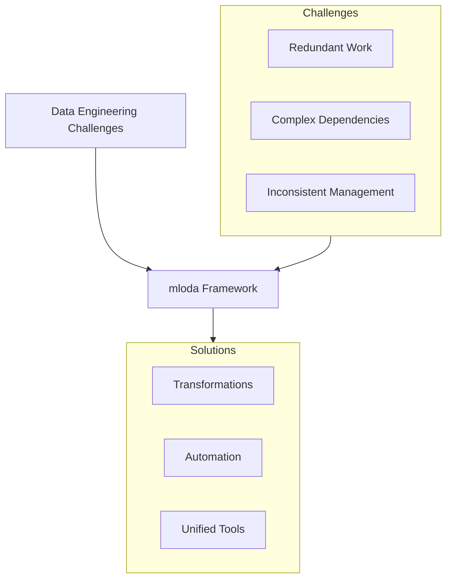

# Product Context

## Why mloda Exists

## Core Value
- **Reduces redundant work** through reusable transformations
- **Manages dependencies** automatically between features
- **Unifies tools** (catalogs, stores, versioning, lineage) into one solution

## User Experience
- Streamlined feature engineering
- Repeatable, reusable features
- Clear communication between users, engineers, and owners
