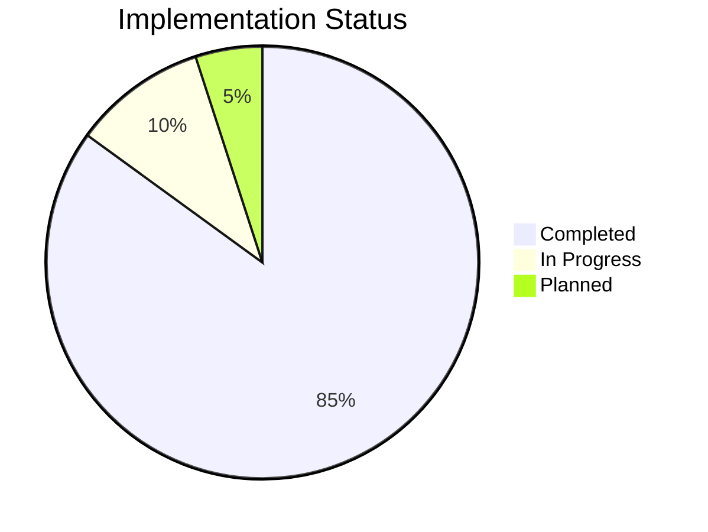
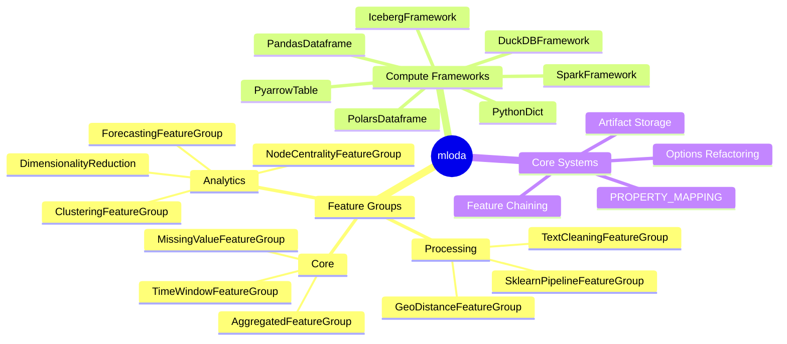
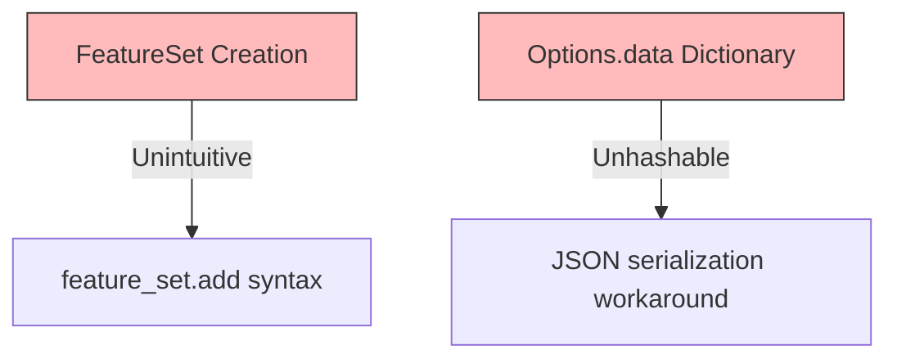

# Progress

## Status Overview

## Working Features

## Recent Achievements
- ✅ Options object refactoring with group/context separation
- ✅ All Feature Groups modernized to PROPERTY_MAPPING
- ✅ Sklearn Pipeline with artifact storage
- ✅ Complete compute framework implementations

## Known Issues

- **FeatureSet creation**: Requires `FeatureSet()` then `.add(feature)`
- **Options.data dictionaries**: Can't hash dict values, use JSON serialization

