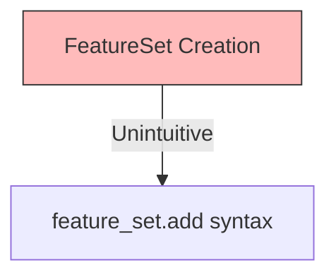

# Progress

## Status Overview

## Working Features

## Recent Achievements
- ✅ Options object refactoring with group/context separation
- ✅ All Feature Groups modernized to PROPERTY_MAPPING
- ✅ Sklearn Pipeline with artifact storage
- ✅ Complete compute framework implementations
- ✅ **Options.data property deprecated and removed** (October 2025)

## Known Issues

- **FeatureSet creation**: Requires `FeatureSet()` then `.add(feature)`

