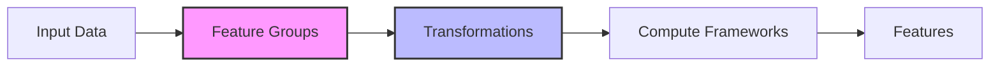

# Project Brief

## Core Goal
mloda: A flexible data/feature engineering framework that focuses on transformations rather than static states.

## Core Requirements
*   Provide a flexible and resilient framework for data and feature engineering.
*   Focus on defining transformations rather than static states.
*   Facilitate smooth transitions between development phases.
*   Reduce redundant work.
*   Maintain high data quality, governance, and scalability.
*   Enable efficient querying and processing of complex features.
*   Promote the sharing and reuse of plugins through a centralized repository.

- **Plugin-based architecture**: Feature Groups, Compute Frameworks, Extenders
- **Transformation focus**: Define how data changes, not static states
- **Automatic plugin selection**: Framework selects appropriate plugins
