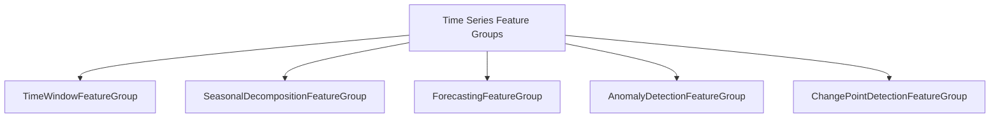
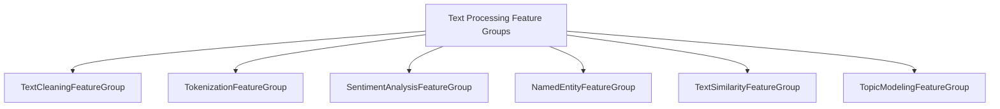
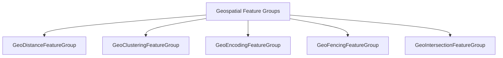
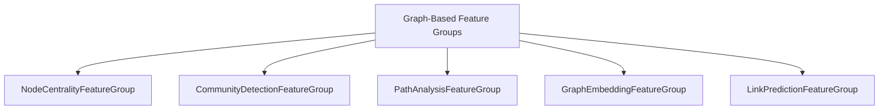
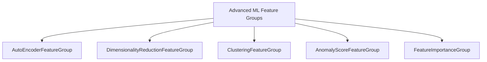
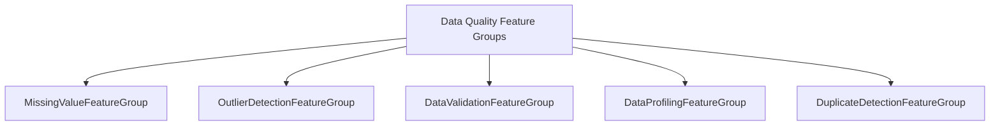

# Proposed Feature Groups

## Quick Implementation To-Do List

| Category | Feature Group | Priority | Status |
|----------|--------------|----------|--------|
| Time Series | TimeWindowFeatureGroup | High | Implemented |
| Data Quality | MissingValueFeatureGroup | High | Implemented |
| ML | ClusteringFeatureGroup | High | To Do |
| Text Processing | TextCleaningFeatureGroup | Medium | To Do |
| Geospatial | GeoDistanceFeatureGroup | Medium | To Do |
| ML | DimensionalityReductionFeatureGroup | Medium | To Do |
| Text Processing | SentimentAnalysisFeatureGroup | Low | To Do |
| Time Series | ForecastingFeatureGroup | Low | To Do |
| Graph-Based | NodeCentralityFeatureGroup | Low | To Do |

## Feature Group Categories

### 1. Time Series Feature Groups



#### TimeWindowFeatureGroup
- **Purpose**: Create rolling window calculations over time series data
- **Naming Convention**: `{window_function}_{window_size}_{time_unit}_window_{source_feature}`
- **Examples**: `avg_7_day_window_temperature`, `max_3_hour_window_cpu_usage`
- **Implementation**: Similar to AggregatedFeatureGroup but with time window parameters

#### SeasonalDecompositionFeatureGroup
- **Purpose**: Decompose time series into trend, seasonal, and residual components
- **Naming Convention**: `{component}_decomp_{source_feature}`
- **Examples**: `trend_decomp_sales`, `seasonal_decomp_website_traffic`

#### ForecastingFeatureGroup
- **Purpose**: Generate forecasts for time series data using various algorithms
- **Naming Convention**: `{algorithm}_forecast_{horizon}_{source_feature}`
- **Examples**: `arima_forecast_7day_sales`, `prophet_forecast_24hr_energy_consumption`

#### AnomalyDetectionFeatureGroup
- **Purpose**: Identify anomalies in time series data
- **Naming Convention**: `anomaly_{algorithm}_{source_feature}`
- **Examples**: `anomaly_isolation_forest_transactions`, `anomaly_zscore_sensor_readings`

#### ChangePointDetectionFeatureGroup
- **Purpose**: Detect significant changes in time series patterns
- **Naming Convention**: `changepoint_{algorithm}_{source_feature}`
- **Examples**: `changepoint_pelt_stock_price`, `changepoint_binseg_user_activity`

### 2. Text Processing Feature Groups



#### TextCleaningFeatureGroup
- **Purpose**: Preprocess and clean text data
- **Naming Convention**: `{cleaning_operation}_text_{source_feature}`
- **Examples**: `normalized_text_review`, `stopword_removed_text_description`

#### TokenizationFeatureGroup
- **Purpose**: Split text into tokens (words, sentences, etc.)
- **Naming Convention**: `{token_type}_tokens_{source_feature}`
- **Examples**: `word_tokens_document`, `sentence_tokens_article`

#### SentimentAnalysisFeatureGroup
- **Purpose**: Determine sentiment of text data
- **Naming Convention**: `sentiment_{model}_{source_feature}`
- **Examples**: `sentiment_vader_review`, `sentiment_bert_feedback`

#### NamedEntityFeatureGroup
- **Purpose**: Extract named entities from text
- **Naming Convention**: `{entity_type}_entity_{source_feature}`
- **Examples**: `person_entity_article`, `location_entity_report`

#### TextSimilarityFeatureGroup
- **Purpose**: Calculate similarity between text fields
- **Naming Convention**: `{similarity_metric}_similarity_{source_feature1}_{source_feature2}`
- **Examples**: `cosine_similarity_description_title`, `jaccard_similarity_abstract_conclusion`

#### TopicModelingFeatureGroup
- **Purpose**: Extract topics from text collections
- **Naming Convention**: `topic_{algorithm}_{source_feature}`
- **Examples**: `topic_lda_documents`, `topic_nmf_articles`

### 3. Geospatial Feature Groups



#### GeoDistanceFeatureGroup
- **Purpose**: Calculate distances between geographic points
- **Naming Convention**: `{distance_type}_distance_{point1_feature}_{point2_feature}`
- **Examples**: `haversine_distance_customer_store`, `manhattan_distance_origin_destination`

#### GeoClusteringFeatureGroup
- **Purpose**: Group geographic points into clusters
- **Naming Convention**: `geo_cluster_{algorithm}_{location_feature}`
- **Examples**: `geo_cluster_dbscan_customer_locations`, `geo_cluster_kmeans_store_locations`

#### GeoEncodingFeatureGroup
- **Purpose**: Convert between address text and coordinates
- **Naming Convention**: `{encoding_direction}_geocode_{source_feature}`
- **Examples**: `forward_geocode_address`, `reverse_geocode_coordinates`

#### GeoFencingFeatureGroup
- **Purpose**: Determine if points are within defined geographic boundaries
- **Naming Convention**: `within_{boundary_type}_{point_feature}`
- **Examples**: `within_radius_customer_location`, `within_polygon_delivery_point`

#### GeoIntersectionFeatureGroup
- **Purpose**: Find intersections between geographic features
- **Naming Convention**: `geo_intersection_{feature1}_{feature2}`
- **Examples**: `geo_intersection_route_restricted_zone`, `geo_intersection_delivery_area_flood_zone`

### 4. Graph-Based Feature Groups



#### NodeCentralityFeatureGroup
- **Purpose**: Calculate centrality metrics for nodes in a graph
- **Naming Convention**: `{centrality_type}_centrality_{node_feature}`
- **Examples**: `degree_centrality_user`, `betweenness_centrality_product`

#### CommunityDetectionFeatureGroup
- **Purpose**: Identify communities within a graph
- **Naming Convention**: `community_{algorithm}_{graph_feature}`
- **Examples**: `community_louvain_social_network`, `community_label_propagation_citation_network`

#### PathAnalysisFeatureGroup
- **Purpose**: Analyze paths between nodes in a graph
- **Naming Convention**: `{path_metric}_{source_node}_{target_node}`
- **Examples**: `shortest_path_customer_product`, `all_paths_supplier_warehouse`

#### GraphEmbeddingFeatureGroup
- **Purpose**: Generate vector embeddings for graph nodes
- **Naming Convention**: `graph_embedding_{algorithm}_{node_feature}`
- **Examples**: `graph_embedding_node2vec_user`, `graph_embedding_deepwalk_article`

#### LinkPredictionFeatureGroup
- **Purpose**: Predict potential new edges in a graph
- **Naming Convention**: `link_prediction_{algorithm}_{graph_feature}`
- **Examples**: `link_prediction_common_neighbors_social_graph`, `link_prediction_adamic_adar_collaboration_network`

### 5. Advanced ML Feature Groups



#### AutoEncoderFeatureGroup
- **Purpose**: Create compressed representations of features using autoencoders
- **Naming Convention**: `autoencoder_{dimension}d_{source_features}`
- **Examples**: `autoencoder_32d_user_behavior`, `autoencoder_128d_image_features`

#### DimensionalityReductionFeatureGroup
- **Purpose**: Reduce feature dimensionality using various techniques
- **Naming Convention**: `{algorithm}_{dimension}d_{source_features}`
- **Examples**: `pca_10d_customer_metrics`, `tsne_2d_product_attributes`

#### ClusteringFeatureGroup
- **Purpose**: Group similar data points using clustering algorithms
- **Naming Convention**: `cluster_{algorithm}_{k_value}_{source_features}`
- **Examples**: `cluster_kmeans_5_customer_behavior`, `cluster_hierarchical_3_transaction_patterns`

#### AnomalyScoreFeatureGroup
- **Purpose**: Calculate anomaly scores for data points
- **Naming Convention**: `anomaly_score_{algorithm}_{source_features}`
- **Examples**: `anomaly_score_isolation_forest_transactions`, `anomaly_score_lof_sensor_readings`

#### FeatureImportanceGroup
- **Purpose**: Calculate importance scores for features
- **Naming Convention**: `importance_{algorithm}_{target_feature}`
- **Examples**: `importance_random_forest_conversion`, `importance_permutation_churn`

### 6. Data Quality Feature Groups



#### MissingValueFeatureGroup
- **Purpose**: Handle missing values in data
- **Naming Convention**: `{imputation_method}_imputed_{source_feature}`
- **Examples**: `mean_imputed_income`, `knn_imputed_age`

#### OutlierDetectionFeatureGroup
- **Purpose**: Identify and handle outliers
- **Naming Convention**: `outlier_{method}_{source_feature}`
- **Examples**: `outlier_zscore_price`, `outlier_iqr_transaction_amount`

#### DataValidationFeatureGroup
- **Purpose**: Validate data against rules or schemas
- **Naming Convention**: `validation_{rule_type}_{source_feature}`
- **Examples**: `validation_range_age`, `validation_format_email`

#### DataProfilingFeatureGroup
- **Purpose**: Generate statistical profiles of data
- **Naming Convention**: `profile_{statistic}_{source_feature}`
- **Examples**: `profile_distribution_income`, `profile_cardinality_category`

#### DuplicateDetectionFeatureGroup
- **Purpose**: Identify duplicate or near-duplicate records
- **Naming Convention**: `duplicate_{method}_{entity_type}`
- **Examples**: `duplicate_exact_customer_record`, `duplicate_fuzzy_product_description`

## Detailed Implementation Guidelines

### General Structure
1. Follow the established pattern in mloda:
   - Create a base abstract class that defines the interface and common functionality
   - Implement concrete classes for specific compute frameworks (Pandas, PyArrow)
   - Organize in a modular folder structure with separate files for base and implementation classes

2. File organization:
   ```
   mloda_plugins/feature_group/
   ├── {category_name}/
   │   ├── __init__.py
   │   ├── base.py
   │   ├── pandas.py
   │   └── pyarrow.py (when applicable)
   ```

### Implementation Considerations
1. **Consistent Naming Conventions**
   - Follow the established naming patterns for each feature group type
   - Ensure feature names are descriptive and follow a consistent format

2. **Validation**
   - Implement proper validation for input and output features
   - Add clear error messages for invalid inputs

3. **Documentation**
   - Add comprehensive docstrings
   - Include examples of usage
   - Update feature_groups.md with new feature group types

4. **Testing**
   - Create unit tests for each feature group
   - Include edge cases and error handling tests
   - Test with different compute frameworks

5. **Dependencies**
   - Minimize external dependencies where possible
   - Document any new dependencies in requirements files
