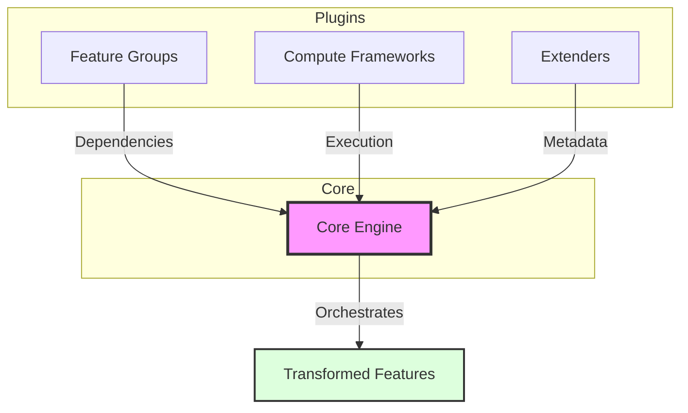

# System Patterns

## Architecture Overview



## Key Design Decisions

- **Transformations over static states**: Define how data changes
- **Plugin-based architecture**: Automatic plugin selection
- **Decoupled execution**: Features independent of compute technology

## Component Roles

```mermaid
flowchart LR
    FG[Feature Groups] -->|Define| Trans[Transformations]
    CF[Compute Frameworks] -->|Execute| Trans
    EX[Extenders] -->|Extract| Meta[Metadata]
    CE[Core Engine] -->|Orchestrate| All[All Components]
