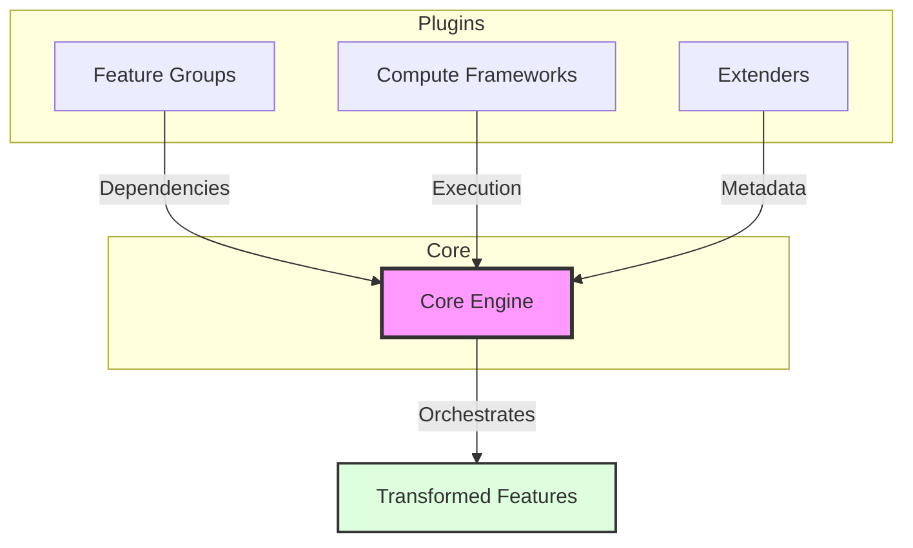
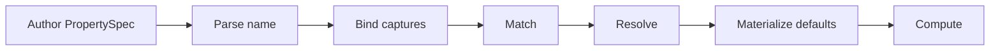
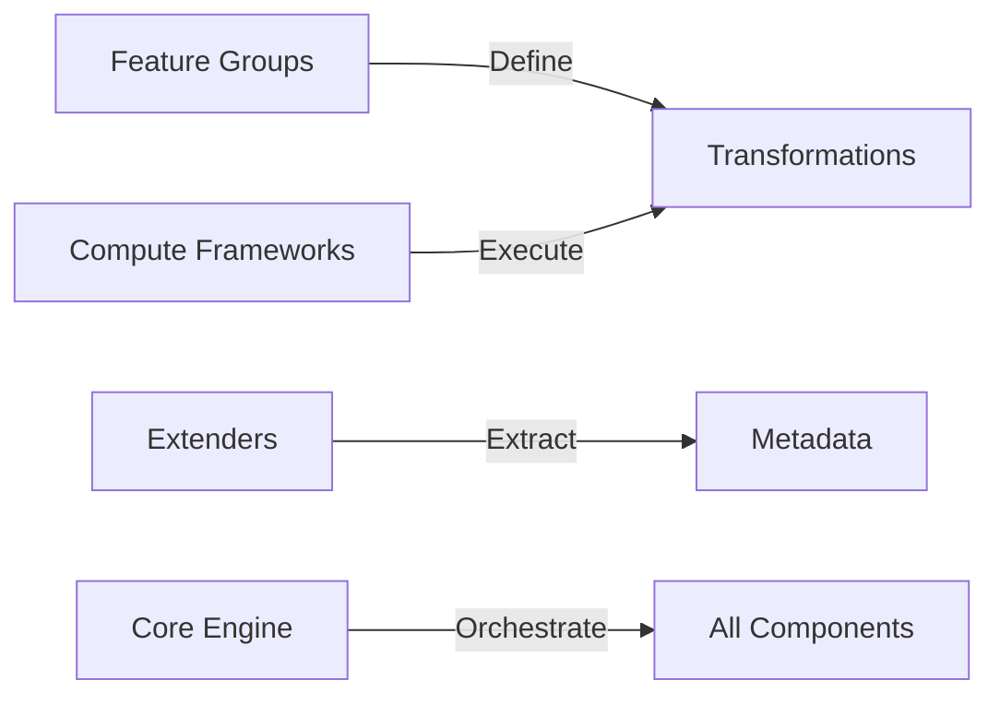

# System Patterns

## Architecture Overview

```mermaid
graph TB
    subgraph Core
        CE[Core Engine]
    end

    subgraph Plugins
        FG[Feature Groups]
        CF[Compute Frameworks]
        EX[Extenders]
    end

    FG --> |Dependencies| CE
    CF --> |Execution| CE
    EX --> |Metadata| CE
    CE --> |Orchestrates| Output[Transformed Features]

    style CE fill:#f9f,stroke:#333,stroke-width:3px
    style Output fill:#dfd,stroke:#333,stroke-width:2px
```

## Key Design Decisions

- **Transformations over static states**: define how data changes, not fixed outputs.
- **Plugin-based architecture**: Feature Groups, Compute Frameworks, Extenders; the engine selects plugins automatically.
- **Decoupled execution**: features are independent of the compute technology.
- **Dependency-free core**: the `mloda` core declares no runtime dependencies; the PythonDict backend also needs none, while every other backend is an optional extra.

## PropertySpec lifecycle

A FeatureGroup declares its configuration surface as `PROPERTY_MAPPING: dict[str, PropertySpec]`. The typed, frozen `PropertySpec` is the single contract; raw-dict specs are a hard error. Each option key flows through the stages below, from authoring to compute. Types live in `mloda/core/abstract_plugins/components/feature_chainer/`.

```mermaid
flowchart LR
    A[Author PropertySpec] --> P[Parse name]
    P --> B[Bind captures]
    B --> M[Match]
    M --> R[Resolve]
    R --> D[Materialize defaults]
    D --> C[Compute]
```

1. **Author** (`property_spec.py`): `property_spec()` (or `PropertySpec(...)`) builds a frozen spec whose `__post_init__` enforces every invariant. `NO_DEFAULT` marks a key required; `is_no_default()` tests for it by type, not identity, so a reimported module copy still reads correctly. `PropertySpec`, `property_spec`, `NO_DEFAULT`, `is_no_default`, `is_positive_int` are all exported from `mloda.provider`.
2. **Parse**: `FeatureChainParser.parse_name` (`feature_chain_parser.py`) returns a frozen `ParsedFeatureName` (`parsed_feature_name.py`) recording exactly what `re` found. `operation_part` is the raw suffix, never a fabricated token.
3. **Bind** (`feature_chain_parser.py`): `bind_name_captures` binds named captures exclusively by name into an effective `Options`; a captureless pattern is a recognition predicate that identifies the group and binds nothing. A present option value always wins over a name-derived one. A transitional positional fallback (`_legacy_operation_config`) still reverse-looks-up single-capture legacy patterns, pending downstream migration (mloda-registry#327).
4. **Match**: `match_configuration_feature_chain_parser` validates present values (a bad value raises `PropertyValueRejection`, a `ValueError` verdict rather than a crash) and enforces required presence on the string-named path.
5. **Resolve** (`prepare/identify_feature_group.py`): `IdentifyFeatureGroupClass.evaluate` runs one non-raising resolution pass, recording per-candidate elimination facts (`EvaluationResult`, `Elimination`) so a failure explains which gate each near-miss failed. Class-definition-time checks reject order-dependent bindings and install guards enforcing `required_when` and name-path required presence; an all-optional matcher that would match any name emits a definition-time warning unless the class sets `ALLOW_UNIVERSAL_MATCHER`.
6. **Materialize defaults at intake, then compute** (os-008): `Engine.add_feature_to_collection` rebinds each resolved feature's options through `options_with_defaults()` as it enters the plan, so default-equivalent twins (same name, one key explicitly set to its declared default) merge through the standard duplicate path with uuid remapping. `ComputeFramework.run_calculate_feature` (`@final`) still calls `FeatureSet.materialize_option_defaults` as an idempotent safety net for direct API use; its twin-collapse ValueError is unreachable from engine-driven requests. `options_with_defaults()` fills only absent keys that declare a concrete default; `NO_DEFAULT` and a declared `None` fill nothing. Presence honors the explicit-`None` policy: a present `None` counts as set only when the spec sets `allow_explicit_none=True`.

Which lifecycle stages observe which options view:

| Stage | Options view |
|-------|--------------|
| Parse, bind, match, resolve (candidate selection; subtype resolution applies defaults internally) | declared (pre-default) |
| `input_features()` and child option inheritance | declared (pre-default) |
| Splitting, planning, validators, filters, compute | effective (post-default) |

## Component Roles

```mermaid
flowchart LR
    FG[Feature Groups] -->|Define| Trans[Transformations]
    CF[Compute Frameworks] -->|Execute| Trans
    EX[Extenders] -->|Extract| Meta[Metadata]
    CE[Core Engine] -->|Orchestrate| All[All Components]
```
